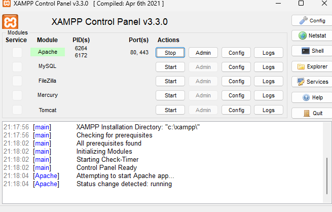
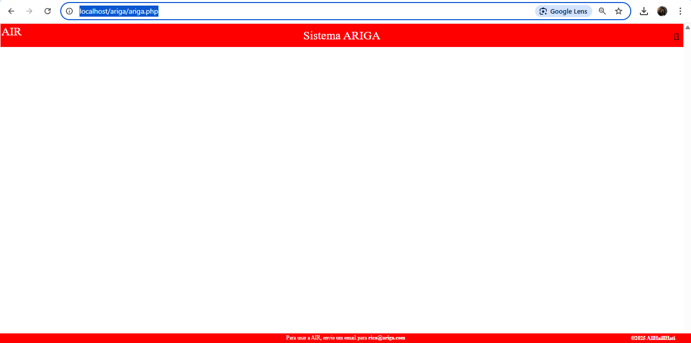

# TFC_DEISI2029_Configurador
- Instalar o Xamp;
- Instalar o posgresql V.10 na porta 5432 (criar user = "ariga" password = "123" com privilegios de gestão da base de dados ARIGA);
- Install pgadmin ,criar base de dados Ariga e fazer restore do backup da base se dados "backupbd_ariga.sql";
- Copiar pastas Arigaweeb para a directoria C:\xampp e htdocs copiar a pasta ariga para a directoria  C:\xampp\htdocs;
- Copiar php.init para C:\xamp\php;
- Inicializar xampp  fazer start ao apache;
- Excutar link no browzer http://localhost/ariga/ariga.php ;
- Para fazer login utilizador : rica@ariga.com passoword : 11111111;
